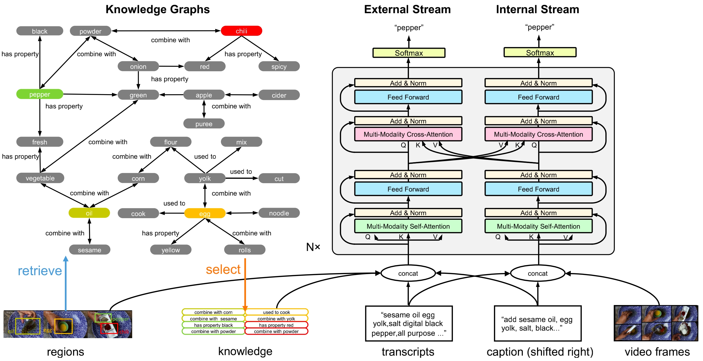

# TextKG
<<<<<<< HEAD
Text with Knowledge Graph Augmented Transformer for Video Captioning
=======
[[Paper]](https://arxiv.org/abs/2303.12423) 

Official code for **Text with Knowledge Graph Augmented Transformer for Video Captioning**. <br>

*Xin Gu, Guang Chen, Yufei Wang, Libo Zhang, Tiejian Luo, Longyin Wen*

Accepted by CVPR2023<br>

## Introduction
Existing video captioning methods generally have long tail problems. We present TextKG, a knowledge graph (KG) augmented transformer for video captioning, which integrates external knowledge and exploits multi-modality information in videos to address the challenge of long-tail words. 

## Approach
### Knowledge Graphs Construction
- General knowledge graph (G-KG) is designed to include the most keyinformation in general scenarios in which we are interested, suchas cooking and activity. It is built from the public available giant knowledge graph ConceptNet by extracting keywords in ConceptNet with the connected edges and neighboring nodes.
- Specific knowledge graph (S-KG) is built to cover key information in specific scenarios. We extract speech transcripts from videos using an automatic speech recognition (ASR) model. We gather phrases such as “adjective and noun”, "noun and noun”, and "adverb and verb" to construct the S-KG.

### Two-Stream Transformer
Our approach comprises an external stream that can utilize external knowledge information and an internal stream that can leverage the multimodal information from the video.

## Architecture


<center><div style="color:orange; display: inline-block; color: black; padding: 2px;">Figure 1.TextKG Network</div></center>


## Usage

Our proposed TextKG is implemented with PyTorch.

#### Environment

- Python = 3.7
- PyTorch = 1.4
- pycocoevalcap

#### 1.Installation

- Clone this repo:

```
git clone https://github.com/GX77/TextKG.git
cd TextKG
```

#### 2.Download datasets

- [YouCooKII](https://drive.google.com/file/d/1mj76DwNexFCYovUt8BREeHccQn_z_By9/view?usp=sharing)

## Training & Testing

#### YouCooKII

```bash
# Training
python3 train.py --res_root_dir YOUR_DIR --dset_name yc2

# Test
python3 translate.py --res_dir YOUR_DIR
```
We will add other datasets later.


## Citation

If our research and this repository are helpful to your work, please cite with:

```
@InProceedings{Gu_2023_CVPR,
    author    = {Gu, Xin and Chen, Guang and Wang, Yufei and Zhang, Libo and Luo, Tiejian and Wen, Longyin},
    title     = {Text With Knowledge Graph Augmented Transformer for Video Captioning},
    booktitle = {Proceedings of the IEEE/CVF Conference on Computer Vision and Pattern Recognition (CVPR)},
    month     = {June},
    year      = {2023},
    pages     = {18941-18951}
}
```


## Acknowledge

Code of the decoding part is based on [MART](https://github.com/jayleicn/recurrent-transformer).

>>>>>>> fa85c52 (textkg_youcook2)
